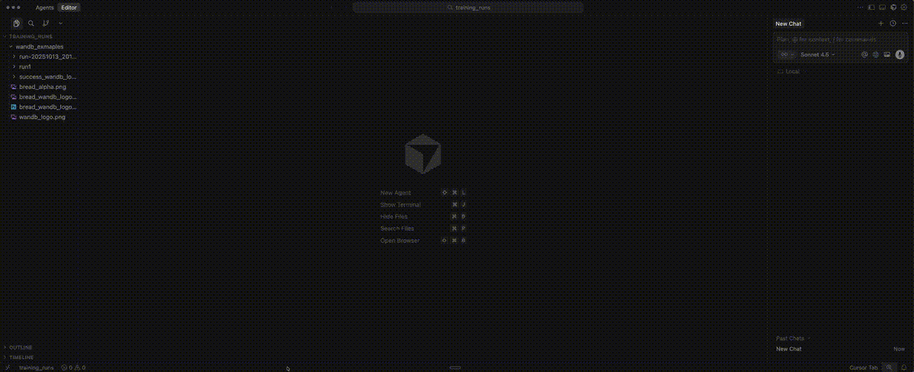
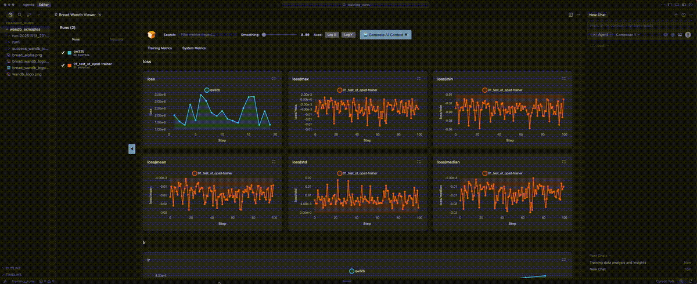

# Bread Wandb Viewer

[](https://marketplace.visualstudio.com/items?itemName=bread-tech.wandb-viewer)
[](https://marketplace.visualstudio.com/items?itemName=bread-tech.wandb-viewer)
[](https://marketplace.visualstudio.com/items?itemName=bread-tech.wandb-viewer)
[](LICENSE)

**Compare ML training runs side-by-side in VS Code - no browser switching, no waiting**

Stop switching to your browser to compare training runs. **Bread Wandb Viewer** brings Weights & Biases visualization directly into VS Code. Compare multiple runs side-by-side with interactive charts, export AI context for Claude Code/Cursor/Codex, and analyze experiments without leaving your editor.

Perfect for machine learning engineers, deep learning researchers, and data scientists who want to stay in their development environment.

## Multi-Run Comparison in Action


*View multiple training runs in seconds - no browser needed*


*Compare W&B training metrics with interactive sidebar*

---

## Features

- 🔄 **Multi-Run Comparison** - Overlay multiple runs on the same charts with color coding and interactive toggles
- 🤖 **AI Context Export** - One-click markdown export for Claude Code, Cursor, and Codex with token counting
- 🎯 **Interactive Charts** - Zoom, pan, fullscreen, and smooth with EMA (exponential moving average)
- 📂 **Automatic File Watching** - Extension detects new .wandb files and refreshes automatically
- 📊 **System Metrics** - GPU utilization, memory, CPU, disk I/O tracking
- 🔍 **Metadata Comparison** - Side-by-side config and hyperparameter diff highlighting
- 🎨 **Smart Grouping** - Metrics auto-organized by prefix (loss/, train/, val/, gpu.0/)
- 🔒 **100% Offline** - Direct .wandb file parsing with protobuf, no API calls or internet needed
- 🎛️ **Advanced Controls** - Log scales, raw data overlay toggle, adjustable smoothing
- 📁 **Folder Scanning** - Automatically discover all runs in a directory

---

## Quick Start

**View a single run:**
1. Click any `.wandb` file in VS Code Explorer
2. Charts and metrics appear instantly

**Compare multiple runs:**
1. Right-click any folder with W&B runs
2. Select "Bread Wandb Viewer"
3. Check/uncheck runs in sidebar to compare

That's it! No configuration needed.

---

## Visual Demos

### AI Context Generation


*One-click AI context export for Claude Code, Cursor, and Codex*

---

## Features in Depth

### 🔄 Multi-Run Comparison

Compare training runs side-by-side to understand what hyperparameters and configurations work best - all without leaving VS Code.

- Overlay multiple runs on the same charts
- Color-coded run identification
- Interactive sidebar for toggling runs on/off
- Resizable sidebar for better workspace management
- Automatic folder scanning for all runs

Ideal for hyperparameter tuning, ablation studies, and experiment analysis. No need to switch to your browser to compare metrics.

### 🤖 AI Context Export

Export your training runs as AI-optimized markdown for coding assistants like Claude Code, Cursor, and Codex.

Perfect for:
- Debugging training code with AI assistance
- Analyzing hyperparameter impact on model performance
- Generating experiment summaries and insights
- Understanding why certain runs performed better

Features:
- One-click copy to clipboard or save to file
- Token count estimation for context planning
- Formatted comparison tables
- CSV metric data for analysis
- Configuration diffs highlighted

### 🎯 Interactive Charts

Advanced chart controls for detailed metric analysis.

- **Smoothing:** Adjustable EMA smoothing with real-time preview
- **Zoom:** Drag to select region and zoom in
- **Pan:** Shift+drag to navigate zoomed charts
- **Fullscreen:** Click expand icon on any chart
- **Log Scales:** Toggle X and Y axis logarithmic scales
- **Raw Data Overlay:** View smoothed and raw data simultaneously
- **Auto-decimation:** Large datasets (500+ points) automatically downsampled for performance

### 📂 Automatic File Watching

The extension automatically detects when new .wandb files are created or updated and refreshes the view without manual intervention.

- No refresh button needed
- Works seamlessly with running training scripts
- Detects new runs added to folders
- Updates existing run views when files change

### 📊 Metadata & System Metrics

View comprehensive run information beyond just training metrics.

**Run Metadata:**
- GPU type and count
- Python version
- CPU count and CUDA version
- Git remote and commit
- Runtime start timestamp

**System Metrics:**
- GPU utilization and memory
- CPU usage
- Disk I/O
- Memory consumption

### 🔒 100% Offline & Private

Your training data never leaves your machine.

- Reads `.wandb` files directly using protobuf
- No wandb CLI or API needed
- No internet connection required
- Works completely offline
- Zero telemetry on your training data (see Privacy section below)

---

## Installation

Install from the [VS Code Marketplace](https://marketplace.visualstudio.com/items?itemName=bread-tech.wandb-viewer), or download the `.vsix` from [releases](https://github.com/Bread-Technologies/bread_wandb_viewer_extension/releases):

```bash
code --install-extension wandb-viewer-0.2.2.vsix
```

### Requirements

- VS Code 1.74.0 or higher
- Training runs created with wandb SDK 0.15+

---

## Commands & Usage

| Command | How to Access | Description |
|---------|---------------|-------------|
| **Bread Wandb Viewer** | Right-click folder in Explorer | Opens multi-run comparison view for all `.wandb` files in folder |
| **Open .wandb file** | Click any `.wandb` file | Opens single run view with charts and metadata |

### Keyboard Shortcuts

| Action | Shortcut |
|--------|----------|
| Zoom into region | Click chart + drag |
| Pan across chart | Shift + drag |
| Reset zoom | Double-click chart |

---

## Privacy & Analytics

This extension collects **anonymous** usage analytics to help improve the product. We take your privacy seriously.

### What We Collect

- Feature usage (which features you use)
- Performance metrics (parse times, load times)
- Error events (crashes and bugs)
- Chart interactions (smoothing settings, zoom actions)

### What We DO NOT Collect

- ❌ Run names or project names
- ❌ Metric values or training data
- ❌ File paths or code
- ❌ Hyperparameters or configurations
- ❌ Any personally identifiable information (PII)

### How to Opt Out

**Option 1: Via Settings UI**
1. Open Settings (`Cmd+,` or `Ctrl+,`)
2. Search for "telemetry level"
3. Set **Telemetry Level** to "off"

**Option 2: Via settings.json**
1. Open Command Palette (`Cmd+Shift+P` / `Ctrl+Shift+P`)
2. Type "Preferences: Open User Settings (JSON)"
3. Add: `"telemetry.telemetryLevel": "off"`

The extension respects your editor's global `telemetry.telemetryLevel` setting. Learn more about [VS Code telemetry](https://code.visualstudio.com/docs/configure/telemetry#_extensions-and-telemetry).

---

## Technical Details

For developers and power users interested in how this extension works.

### Architecture

- **Binary Parsing:** Direct protobuf parsing of `.wandb` files (LevelDB-style format)
- **No Dependencies:** No wandb CLI, API, or internet connection required
- **Performance:** LRU cache (20 runs), LTTB decimation for large datasets, lazy chart initialization
- **File Watching:** Automatic detection of file changes with 1-second debouncing
- **Chart Library:** Chart.js 4.4.0 with zoom plugin for interactive visualizations

### Supported Record Types

- HistoryRecord (per-step training metrics)
- ConfigRecord (hyperparameters)
- SummaryRecord (final summary stats)
- StatsRecord (system statistics)
- EnvironmentRecord (Python, GPU, host metadata)
- RunRecord (project name, run ID, display name)
- And 15+ other internal record types

### Performance Optimizations

- **Quick Metadata:** Reads only first 16KB for fast folder scanning
- **Metric Decimation:** LTTB algorithm for datasets >500 points
- **Lazy Loading:** Charts initialized only when visible
- **LRU Cache:** Parsed run data cached (max 20 runs)
- **Debounced Updates:** File changes debounced to 1 second

---

## Actively Maintained

- ✅ Current version: 0.2.2
- ✅ Compatible with VS Code 1.74+
- ✅ Tested with wandb SDK 0.15+
- ✅ Open Source - contributions welcome

---

## Issues & Support

Found a bug or have a feature request?

- **Report Issues:** [GitHub Issues](https://github.com/Bread-Technologies/bread_wandb_viewer_extension/issues)
- **Pull Requests:** Contributions welcome!
- **Documentation:** [Source Code](https://github.com/Bread-Technologies/bread_wandb_viewer_extension)

---

## Why Bread Wandb Viewer?

**Problem:** Switching between VS Code and your browser to compare training runs breaks your flow and slows down iteration.

**Solution:** View and compare everything in VS Code. Multi-run comparison, AI context generation, and interactive charts - all without leaving your editor.

**Result:** Stay focused, iterate faster, and leverage AI coding assistants to analyze your experiments.

---

Made with ❤️ by [Bread Technologies](https://github.com/Bread-Technologies)
